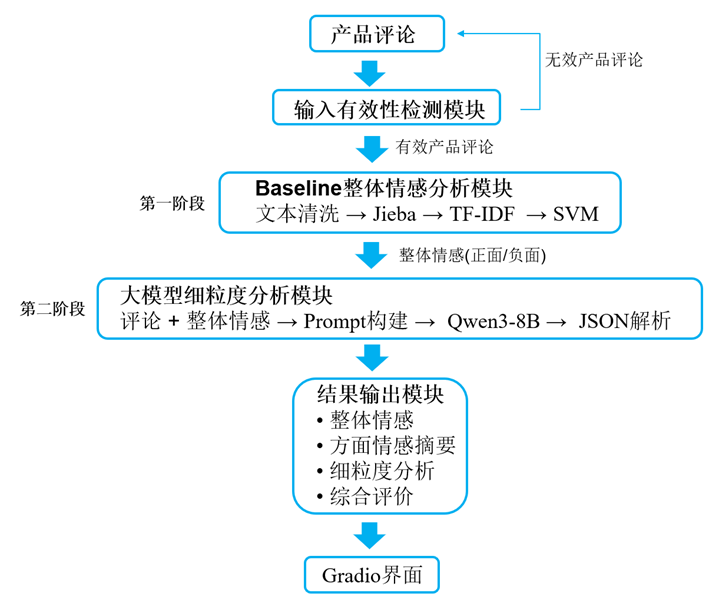

# 基于大语言模型的产品评论细粒度情感分析系统

## 项目简介

本项目实现了一个基于大语言模型（LLM）的产品评论细粒度情感分析系统。

系统首先利用传统机器学习方法构建 TF-IDF + SVM 情感分类基线模型，对评论进行整体情感判断；随后结合 Qwen3-8B 大语言模型，对评论中的评价方面（Aspect）、情感倾向（Sentiment）以及评价依据（Evidence）进行细粒度分析，最终生成结构化分析结果和综合评价。

系统支持 Web 可视化界面，能够实现产品评论的自动分析与展示。

---

## 系统框架

```text
产品评论
    │
    ▼
文本预处理
(Jieba + TF-IDF)
    │
    ▼
SVM Baseline
整体情感分类
(正面/负面)
    │
    ▼
原始评论 + Baseline结果
    │
    ▼
Qwen3-8B
细粒度情感分析
    │
    ▼
Aspect
Sentiment
Evidence
    │
    ▼
综合评价生成
```

---

## 主要功能

### 1. 整体情感分析

利用 TF-IDF + SVM 模型判断评论整体情感：

- 正面
- 负面

示例：

```text
评论：
质量太差了，用了两天就坏了，物流也很慢

结果：
负面
```

---

### 2. 方面级情感分析

识别评论中的评价方面：

例如：

- 质量
- 物流
- 价格
- 服务
- 性能
- 包装
- 外观
- 电池
- 屏幕

并判断对应情感。

示例：

```text
质量：负面
物流：负面
```

---

### 3. 大模型细粒度分析

利用 Qwen3-8B 提取：

- Aspect（评价方面）
- Sentiment（情感倾向）
- Evidence（评价依据）

示例：

```text
评论：
这个电脑运行速度很快，但是价格有点贵，物流太慢了。

分析结果：

性能：
正面
依据：运行速度很快

价格：
负面
依据：价格有点贵

物流：
负面
依据：物流太慢了
```

---

### 4. 综合评价生成

根据整体情感与细粒度分析结果自动生成总结。

示例：

```text
综合来看，该评论整体偏负面。

用户对产品性能表示满意，
但对价格和物流存在明显不满，
其中物流问题是影响用户体验的重要因素。
```

---

### 5. 输入有效性检测

系统能够识别非评论类输入。

示例：

```text
输入：
你好

结果：
无效产品评论
```

---

## 项目结构

```text
EmotionAnalysis
│
├── app_gradio.py
│   Web可视化界面
│
├── llm_finegrained_predict1.py
│   细粒度情感分析主程序
│
├── train_svm.py
│   SVM训练脚本
│
├── datasets
│   └── online_shopping_10_cats.csv
│
├── svm_weight
│   └── baseline_all_cats
│       ├── svm_sentiment_model.pkl
│       └── tfidf_vectorizer.pkl
│
├── models
│   └── Qwen3-8B
│
└── README.md
```

---

## 数据集

使用数据集：

**online_shopping_10_cats**

包含：

- 书籍
- 平板
- 手机
- 水果
- 酒店
- 洗发水
- 热水器
- 蒙牛
- 服装
- 计算机

共 10 个商品类别。

标签：

```text
1 = 正面
0 = 负面
```

---

## 环境配置

Python：

```bash
Python 3.10+
```

安装依赖：

```bash
pip install -r requirements.txt
```

---

## requirements

```text
torch
transformers
accelerate
gradio
pandas
numpy
jieba
scikit-learn
matplotlib
joblib
tqdm
```

---

## 模型训练

训练 SVM Baseline：

```bash
python train_svm.py
```

训练完成后生成：

```text
svm_sentiment_model.pkl
tfidf_vectorizer.pkl
```

---

## 启动系统

```bash
CUDA_VISIBLE_DEVICES=3 python app_gradio.py
```

启动成功后：

```text
http://localhost:7860
```

---

## 示例

输入：

```text
这个电脑运行速度很快，
屏幕也很清晰，
但是价格有点贵，
物流太慢了。
```

输出：

```text
整体情感：
负面

方面情感：

性能：正面
价格：负面
物流：负面

细粒度分析：

用户对产品性能表示满意，
但对价格和物流存在不满。

综合来看，
该评论整体偏负面。
```

---

## 技术路线

### Baseline

```text
Jieba
+
TF-IDF
+
LinearSVC
```

---

### 细粒度分析

```text
Qwen3-8B-Instruct
+
Prompt Engineering
```

---

### 前端展示

```text
Gradio
```

---

## 创新点

1. 构建传统机器学习情感分类 Baseline；
2. 利用 Baseline 提供整体情感参考；
3. 引入大语言模型完成方面级细粒度情感分析；
4. 自动生成评价依据与综合总结；
5. 提供可视化 Web 分析界面。

---

## 效果展示

### 系统首页


### 情感分析结果


---

## 作者

研究生课程项目

产品评论细粒度情感分析系统